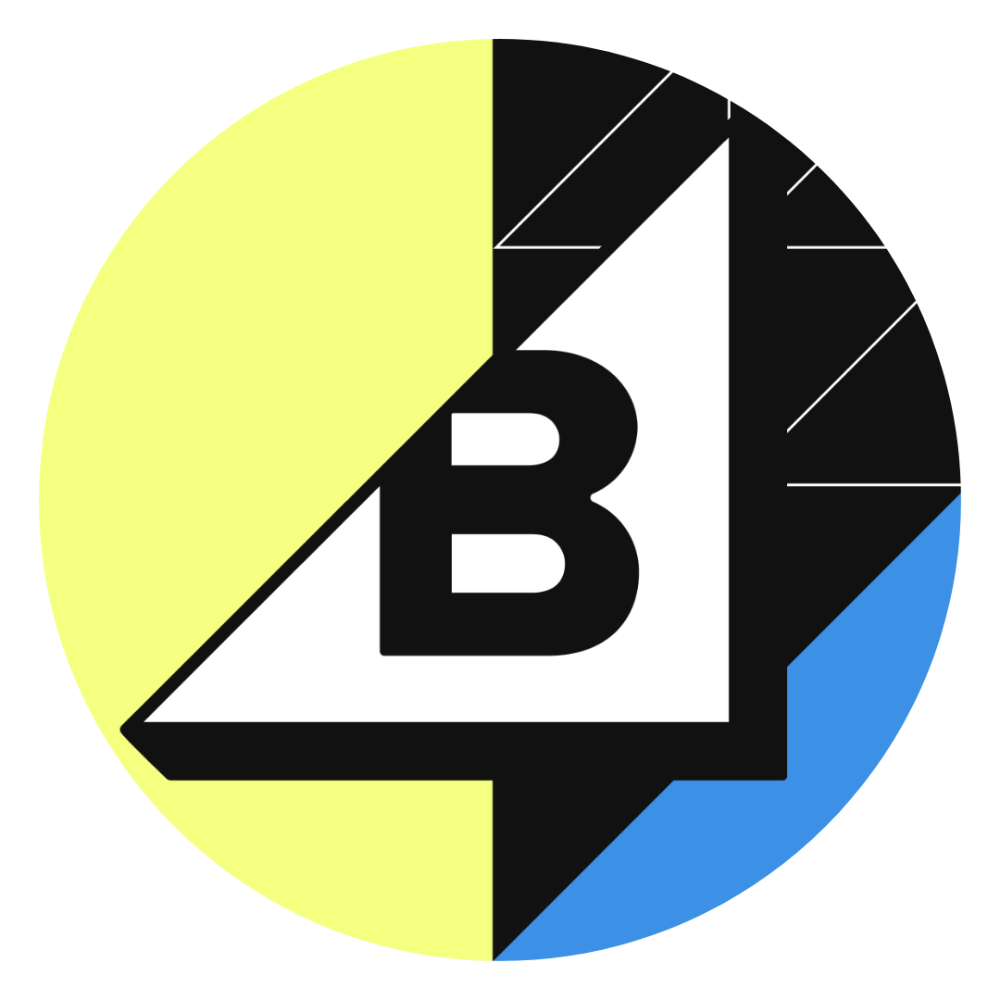

<p align="center">
  
  <h1 align="center">BigCommerce developer documentation</h1>
</p>

You've found the BigCommerce documentation GitHub repository, which contains the public content for the [BigCommerce Developer Center](https://developer.bigcommerce.com/docs).

This repo is the source of truth for our public, open source documentation and API reference at [developer.bigcommerce.com](https://developer.bigcommerce.com). It consists of **Markdown React (.mdx)**, **OpenAPI Specification (.yml)**, and **JSON Schema (.json and .yml)** files.

The BigCommerce DX team maintains these open source docs; we welcome your [issues](https://github.com/bigcommerce/docs/issues), [discussions](https://github.com/bigcommerce/docs/discussions), and [pull requests](https://github.com/bigcommerce/docs/pulls)!

---

## Contributing
Thanks for your interest in contributing to our documentation! Below are a few quick ways to get started: 

### 👉 To make a change 
Here are some quick links to our [Contribution](/CONTRIBUTING.md) guide: 

- [Making a Quick Edit](/CONTRIBUTING.md#making-a-quick-edit)
- [Editing Locally](/CONTRIBUTING.md#editing-locally)
- [Commit Messages](/CONTRIBUTING.md#commit-messages)
- [Style Guides](/CONTRIBUTING.md#style-guides)
- [Contributing to Other Projects](/CONTRIBUTING.md#contributing-to-other-projects)

### 👉 To discuss something 
- Start a [Discussion](https://github.com/bigcommerce/docs/discussions). Our DevDocs team monitors GitHub Discussions regularly.

### 👉 To report a bug or an issue you've encountered
- Open a new [Issue](https://github.com/bigcommerce/docs/issues). Our DevDocs team monitors GitHub Issues regularly.

<br/>

*For more information, see our [Contribution Guidelines](./CONTRIBUTING.md) and [Code of conduct](./CODE_OF_CONDUCT.md).*

---

## API specifications

If you maintain API clients, this repository is your source for the most up-to-date public API specifications.

Always update your fork to ensure you're working with the newest source files.

<!-- Significant dates include the following:

* As of August 22, 2022, all API specification files are in OAS 3+ format.
* In March 2023, we made significant changes to support a new OAS parser at [developer.bigcommerce.com](https://developer.bigcommerce.com).
* In May 2023, we subdivided both the Catalog and Payments API specifications into multiple files.
* On December 27, 2023, all public docs moved into the [bigcommerce/docs](https://github.com/bigcommerce/docs) repo. -->


## Directory structure

```shell
.
├── .github/                           # GitHub config
    └── workflows/                     # workflows to lint pull requests, etc.
    └── ...
├── .idea/                             # directory ignored by Git - use for yourself
├── .style/                            # CSPELL data files
├── assets/ 
    ├── csv/                           # static files used in docs
    ├── images/                        # images and screenshots
    ├── json/                          # theme translation files
    └── PO/
├── diataxis-templates/                # templates for contributing to our documentation                             
├── docs                               # narrative documentation
    ├── api-docs/                      
    ├── bigcommerce-for-wordpress/     
    ├── legacy/                        # Blueprint and V2 API docs
    ├── msf/                           # MSF docs
    ├── partner-apps/                  # docs for some partner integrations
    └── stencil-docs/   
├── examples                           # example data for Stencil Handlebars context objects
├── models                             # JSON schemas in YAML
    ├── _root                          # YAML schemas for root Stencil Handlebars context objects
    ├── ...
├── reference/                         # OpenAPI specification files
    ├── catalog/                       # catalog OAS API reference
    ├── payments/                      # payments OAS API reference
    └── ...                            # other OAS API reference
├── theme-styles          
    ├── _root                          # MDX files for Stencil style configuration options
├── .cspell.json  
├── .eslintrc.json                     # config for MDX linter
├── .gitignore                         # gitignore
├── .nojekyll    
├── .nvmrc                             # config for NVM
├── .spectral.yaml                     # config for OAS linter
├── CODE_OF_CONDUCT.md                 # Code of Conduct for participants
├── CONTRIBUTING.md                    # guidelines for contribution
├── package-lock.json                  
├── package.json                       
├── pull_request_template.md           # template for most pull requests
└── README.md

```

## Archived docs 
View our archived documentation [here](/archive/). 

---
## Our developer channels: 
* [Join our Developer Slack space](https://developer.bigcommerce.com/slack)
* [Read or contribute to our Resource Hub](https://developer.bigcommerce.com/resource-hub)
* [Follow us on X (Twitter) @BigCommerceDevs](https://twitter.com/BigCommerceDevs)
* [Follow the BigCommerce Developers Linkedin](https://www.linkedin.com/showcase/bigcommercedevs/)
