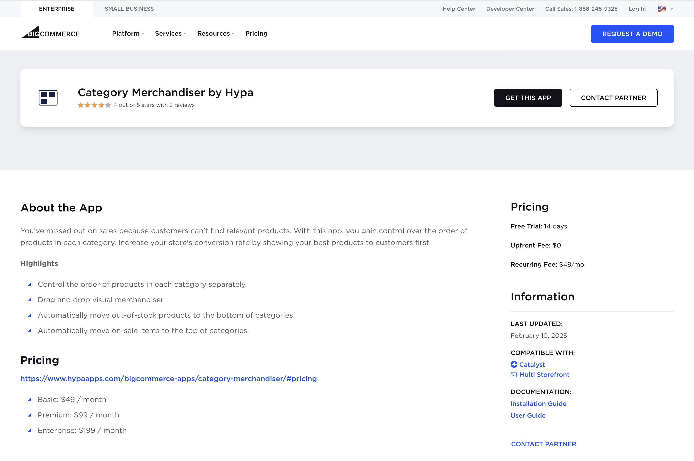

# Building Catalyst-compatible apps

Before diving into information regarding Catalyst-compatible apps, it’s important to explicitly define some important terms:
---
## Glossary

- **App**: When we refer to an "app" in this guide, we are referring to a Single-Click Application which you can find listed in the BigCommerce app marketplace.
- **Storefront Apps**: Storefront apps are a type of app focused on modifying or enhancing the user experience on the rendered storefront, often via script injection or widget rendering, using APIs such as the Scripts API or Widgets API.
  - **Characteristics:**
    - Modify storefront behavior or appearance (e.g., popups, badges, live chat)
    - Inject JavaScript or HTML/CSS into the storefront
    - Often depend on Stencil-specific DOM structure or Stencil Theme Objects
    - Incompatible or partially functional on headless storefronts (unless they provide APIs or SDKs)
  - **Examples:**
    - Cross-sell widgets
    - Popups (Cart upsell/marketing/email collection/discount/etc. popups)
    - On-site reviews with rich visual components
    - Live chat or analytics that depend on DOM events
- **Back-Office Apps**: Back-office apps interact primarily with BigCommerce’s APIs (e.g., Products, Orders, Customers, Catalog, etc.) to modify or consume store data, but do not directly alter the rendering or behavior of the storefront itself.
  - **Characteristics:**
    - No dependency on the DOM structure of the storefront or Stencil Theme Objects
    - May affect what data is available on the storefront but not how it’s rendered or how users interact with it
  - **Examples:**
    - Inventory sync tools
    - ERP integrations
- **Integration**: When we refer to an "integration," we are referring to custom logic that has been added to your e-commerce operations to help connect your store to the outside world. In other words, an App is a type of integration.
---
## What do I need to do to reach Catalyst-compatibility?

Below are a series of use cases that will help you identify what you need to do to make your app compatible with Catalyst storefronts.

### I have a back-office app that I think may be compatible with Catalyst out of the box.

It’s likely that your app or integration is already compatible with Catalyst if it is a backend integration and that there are no major changes needed.

#### How can I ensure my app/integration is compatible with Catalyst?
- Set up a Catalyst storefront in your Control Panel.
- If you meet all criteria and believe your app is compatible, begin the verification process.

### I am the maintainer of an existing Single-Click App and want to determine if my app is compatible with Catalyst.

#### Follow these steps:

1. **Is your Single-Click App Multi-Storefront compatible?**
   - Catalyst requires its own storefront channel, so your app must be Multi-Storefront compatible.
   - If not, make your app MSF compatible first.
   - If it is, proceed to Step 2.
2. **Does your app modify the storefront?**
   - If not, it may already be Catalyst-compatible.
   - Test it by creating a Catalyst storefront and verifying functionality.
   - If yes, proceed to Step 3.
3. **How does your app modify the storefront?**
   - If via Scripts, proceed to Step 4.
   - If via Widgets, proceed to Step 5.
4. **My app modifies the storefront through the use of Scripts.**
   - If your script does not rely on the Stencil DOM or Stencil APIs, it may be compatible.
   - Test on a Catalyst storefront to confirm functionality.
5. **My app modifies the storefront through the use of Widgets.**
   - Since Widgets and Page Builder functionalities in Stencil stores do not exist in Catalyst, apps relying on these will need redevelopment.
   - Consider using Makeswift as a flexible alternative for component management.

### I am the developer of a net-new Single-Click App, and want to ensure my app is compatible with Catalyst.

#### Follow these teps:
1. **Understand Catalyst's Architecture**
   - Catalyst uses Next.js and React components for storefront UI.
   - Familiarize yourself with routing, data fetching, and state management.
2. **Assess Your App's Role**
   - Determine if your integration functions independently of the storefront.
   - If it modifies the storefront, decide on delivery method (NPM package, external script, etc.).
3. **Test in a Catalyst Environment**
   - Deploy a Catalyst storefront locally and test thoroughly.
4. **Document the Integration**
   - Provide clear setup instructions for merchants.
5. **Submit Updates to the Marketplace**
   - Highlight Catalyst compatibility and test for performance and accessibility benchmarks.

---

## How will users know my app is Catalyst-compatible?

- We are working on an official verification process.
- Once certified, your app will receive a "Catalyst Compatible" badge in the BigCommerce App Marketplace.

Category Merchandiser by Hypa has been verified as a Catalyst Compatible app, which you can see on the right hand side under the heading “Compatible With”. All apps can expect to see the same UI on their app detail page once compatibility is verified. 
---

## Leverage our BigCommerce Developer ecosystem to learn more

- Join our [BigCommerce Developers Slack](https://developer.bigcommerce.com/slack).
- Align your app with Catalyst’s roadmap, coming soon on the [Catalyst Github repo](https://github.com/bigcommerce/catalyst)!
- Contribute to the [Resource Hub](https://developer.bigcommerce.com/resource-hub) to showcase your integration.

