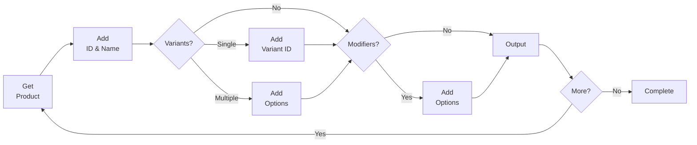

# Complexity Considerations

While order migration can be considered as a strictly “move information from here to here” sort of operation, there are factors that result in higher or lower levels of complexity that will change the ideal strategy used in migration planning.

The content in this page outlines various considerations that go into planning against complexity for your migration strategy. During the preparation phase, you can refer back to the tables and flowcharts in this document to help build a clear understanding of the steps necessary to ensure a successful migration.

While this stage isn’t explicitly necessary, it does help to mitigate potential pain-points in the migration process as a whole.

## Products

If your catalog is primarily simple products, the process only requires selection of products by `product_id`, while catalogs with primarily variable or modified products will require both `product_id` and some identification of the variants, modifiers, and possibly other data points to properly build up the order data. Here’s a breakdown of relevant factors to consider with regard to products:

| Factor | Data | Use Case Example |
| :---- | :---- | :---- |
| Simple Products | `product_id` | Product with only one available ‘type’ |
| Products with variants only | `product_id`, and `variant_id` or `product_options` array | Product with colors or sizes `variant_id` |
| Products with modifiers only | `product_id` and `product_options` array | Product with custom text or other factors unaffected by inventory. |
| Products with both | `product_id`, `product_options` array, and optionally `variant_id`.  | Product with color selections and  custom text |

<Callout type="info">  
While the table above indicates the use of `variant_id` for products with any variants, it can be helpful to split variant selections up in the `product_options` array for clarity in selections made.

This splitting is reflected in the flowchart below, but it isn’t strictly necessary.  
</Callout>

As these features occur on a product-to-product basis, your migration code should account for each possible case that affects your catalog. Ideally you should aim for the minimal implementation that accomplishes your catalog’s needs, but a simple flow-chart for product handling at any complexity follows:



More information on this will be explored when we cover the fields related to the [Create an Order](/docs/rest-management/orders#create-an-order) endpoint.

<Callout type="info">  
Older products no longer listed in your catalog can still be included in your customers’ order history as necessary, but it requires the use of the custom product workflow, which will be outlined when we cover fields.  
</Callout>

## Customers

Customer complexity may be introduced in a few ways, but the primary sources are in address and contact data. Specifically, if billing and shipping information differ, separate objects will need to be built to manage the addresses when building an order’s total object data, but if they are the same a deep copy of one into the other will suffice.

Likewise, if an order includes multiple separate shipping addresses, the array for shipping addresses will contain an address object for each. For older orders that have been completely fulfilled, this is less likely to impact your workflow, but outstanding shipping will require some consideration.

Complexity considerations for customers are outlined here:

| Factor | Data | Use Case Example |
| :---- | :---- | :---- |
| Guest customers | omit `customer_id` field | Customer does not log in, or does not have an account, before or during checkout. |
| Billing address matches shipping address | `billing_address` | Customer ships and bills to a single address, usually attached to an account. |
| Billing address differs from shipping address | `billing_address` and `shipping_addresses` fields | Customer shipping to PO Box or to alternate residence/office. |
| Multiple shipping addresses | `shipping_addresses` array | Customer ordering for multiple locations at once. |
| Consignments | `consignments.pickups` array | Customer picking up whole orders ‘in store’. |

<Callout type="info">  
If the `consignments` object is included in order data, both `shipping_addresses` and `products` must be excluded. This is a restriction on order processing preventing ‘pick up’ and ‘delivery’ from occurring on the same order.  
</Callout>

Just as with products, customer order data may be mixed complexity. As a result, either a pre-migration analysis or an adaptive order workflow should be implemented to capture the full scope of your project. While the latter is more effective, the former can help establish the scope of the adaptive workflow ahead of time and decrease complexity overall.

```mermaid  
flowchart LR  
    B{Has<br />`customer_id`} -->|No| C[Add Billing<br />Address]  
    B -->|Yes| D[Add ID] --> C

    C --> E{Has<br />Consignments}  
    E -->|No| F[Add<br />Products]  
    E -->|Yes| G[Add<br />Consignments] --> H[Complete]  
    F --> I --> H  
    subgraph I[Shipping Addresses]  
        I1{Has Addresses?} -->|No| I2[End]  
        I1 -->|Yes| I3[Add to Array] --> I1  
    end

    click F "#products"  
```

## Order-level

Once customer-specific and product-specific considerations are handled, some order-level issues may arise that increase complexity. For example, orders may have discounts applied that are no longer valid or haven’t been configured within BigCommerce. Alternatively, a specific order might have an order status that is no longer valid for any number of reasons.

There are too many possible causes for order-level complexity to lay them out, but the following table gives several examples of fields that exist, the context they apply, and a use-case example for each.

| Factor | Data | Use Case Example |
| :---- | :---- | :---- |
| Order-level Fees | `fees` array | Shipping to Colorado and applying the Retail Delivery Fee for record-keeping. |
| Customer Comments | `customer_message` field | Customers leave notes for shipping instructions or to thank your team. |
| Staff Notes | `staff_notes` field | Your team leaves comments about order management. Not visible to customers. |
| Gift Wrapping | `*_wrapping_cost` fields | Customers request gift wrapping, if you provide the option. |
| Incomplete Payments | varies | Customers using offline payment methods or customized split payment systems. |

## FAQs

1. **What should I do if my catalog contains custom products not present in BigCommerce?**  
   Use the custom product workflow, providing name, quantity, and price fields. See [Orders API - Create an Order](/docs/rest-management/orders#create-an-order) for details.
2. **Can I migrate guest orders?**  
   Yes. Omit the `customer_id` field for guest orders; use billing address/contact info for identification.
3. **How do I handle orders with multiple shipping addresses?**  
   Include an array under `shipping_addresses` with each address object. Ensure each address is mapped correctly.
4. **What if my order includes both consignments (pickups) and deliveries?**  
   Consignments and shipping addresses/products are mutually exclusive in a single order. Split such orders into separate records if both are needed.
5. **How do I map product variants and modifiers in order data?**  
   Include the relevant `product_id`, `variant_id`, and/or `product_options` array per product line item.
6. **What fields are required for a minimal order migration?**  
   At minimum: `external_source`, `external_order_id`, `status_id`, `date_created`, `billing_address`, `products`. See [Prepare Data](/docs/start/migration/orders/prepare-data) for more.
7. **How do I ensure order data is not duplicated?**  
   Use unique identifiers and check for existing orders before creation. Log all migrated order IDs for auditing.

## Resources

- [Orders API - Create an Order](/docs/rest-management/orders#create-an-order)
- [Catalog API](/docs/rest-catalog)
- [Order Management (Help Center)](https://support.bigcommerce.com/s/article/Guide-to-Order-Management)
- [Payments API](/docs/rest-payments)
- [API Best Practices](/docs/start/best-practices)
