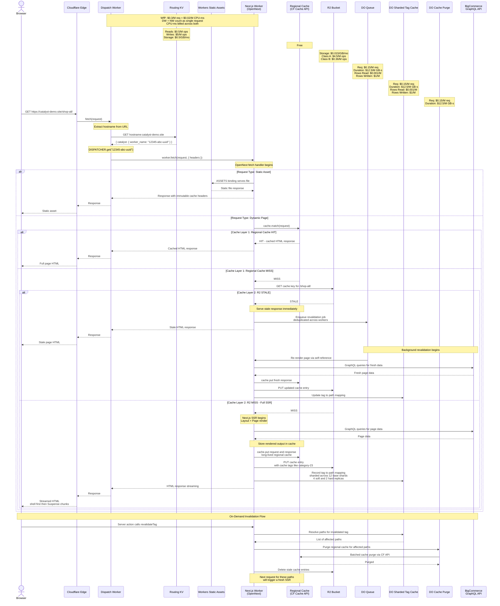

# Native Hosting Request Lifecycle

<Callout type="warning">
  The Catalyst CLI and Native Hosting are currently in closed alpha. There may be breaking changes as we finalize the API.
</Callout>

The following sequence diagram illustrates the full lifecycle of a request to a Catalyst storefront deployed via Native Hosting. It covers static asset serving, dynamic page rendering with multi-layer caching (regional cache and R2), stale-while-revalidate behavior, and on-demand cache invalidation.

