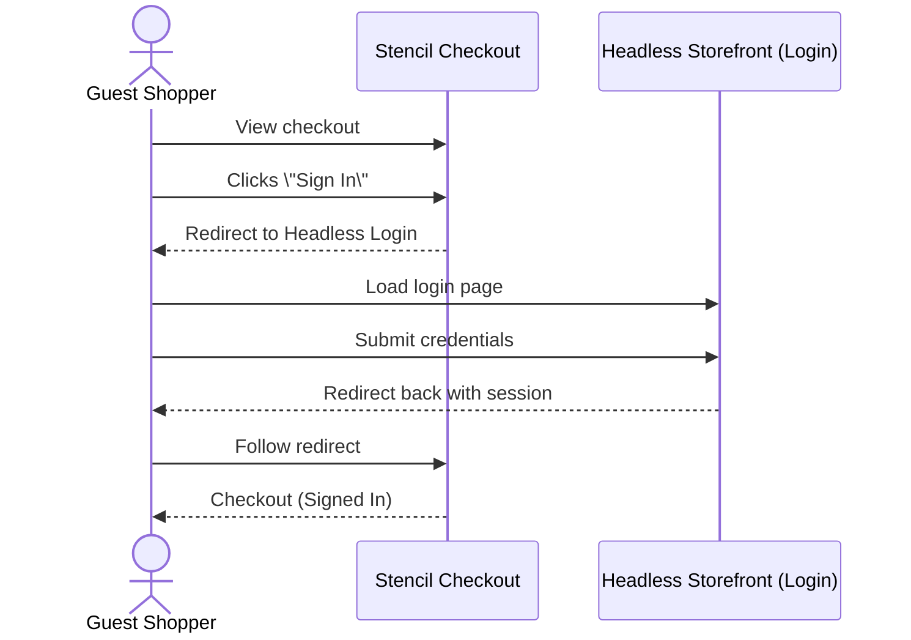
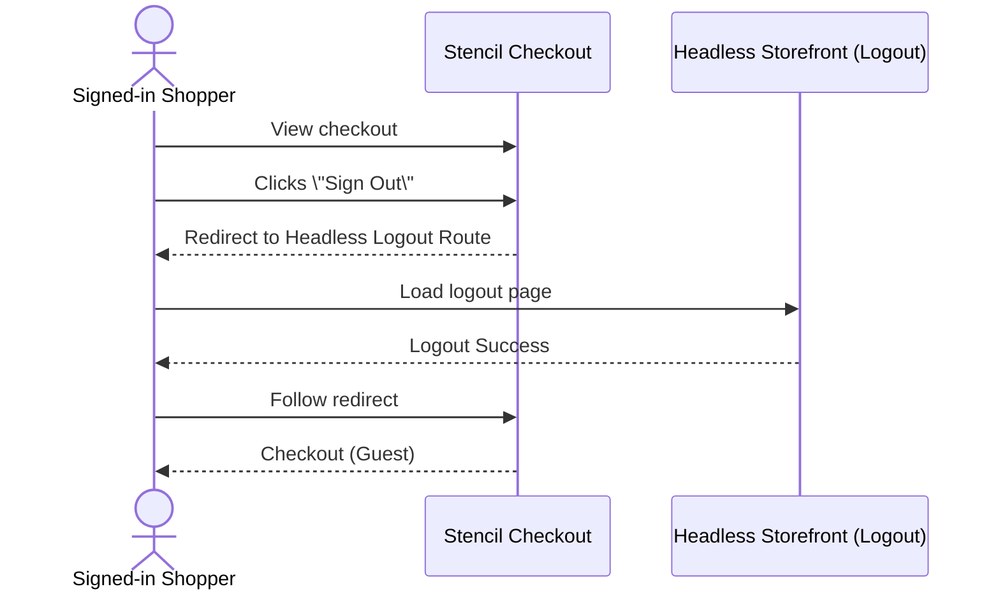

# End-to-End Guide: Session Syncing Between Headless Storefront and Stencil Checkout

This guide outlines the interim solution to sync a shoppers authentication (login/logout) session between a **headless storefront** and **Stencil checkout**.

## Intended Behavior

<Callout type='info'>
	Be aware that this solution removes the ability to **sign in directly at
	checkout**. Instead, authentication must occur through the headless
	storefront's login flow.
</Callout>

### Login Flow

1. The shopper navigates to Stencil Checkout as a **guest**.
2. They click **Sign In**.
3. They're redirected to the **login page on the headless storefront**.
4. After signing in, they're redirected back to **Stencil Checkout**, now **signed in**.

#### Diagram: Login Flow



### Logout Flow

1. The shopper navigates to Stencil Checkout while **signed in**.
2. They click **Sign Out**.
3. They're redirected to the **logout route on the headless storefront**.
4. After signing out, they're redirected back to **Stencil Checkout**, now as a **guest**.

#### Diagram: Logout Flow



## Setup Instructions

### 1. Headless Storefront Configuration (Prerequisite)

Before session syncing can work, your headless storefront must be configured to support authentication redirects.

#### Required Routes and Behavior

<Callout type='warning'>
	**Security note**: For Login/Logout routes, developers are responsible for
	validating the `redirectTo` parameter to prevent open redirects. We recommend
	restricting this to relative paths (e.g. `/checkout`) only.
</Callout>

- **/checkout route**  
  Your headless storefront should include a `/checkout` route that **redirects to BigCommerce Stencil Checkout**.

- **Login route with redirectTo support**  
  Your storefront's login page must accept a `redirectTo` query parameter that determines where the shopper is redirected after login.

- **Logout route with redirectTo support**  
  Your storefront must also expose a `/logout` route that logs the shopper out and then consumes a `redirectTo` query parameter.

#### Channel Guidance

While this setup _can_ be configured on the default channel, we recommend using a **secondary channel** to avoid coupling with your primary storefront.

### 2. **Configure BigCommerce routes**

Use the [Update a Site's Routes](https://developer.bigcommerce.com/docs/rest-management/sites/site-routes#update-a-sites-routes) API call:

```bash
PUT https://api.bigcommerce.com/stores/{store_hash}/v3/sites/{site_id}/routes
```

Payload:
```json
[
	{
		"type": "home",
		"matching": "*",
		"route": "/"
	},
	{
		"type": "cart",
		"matching": "*",
		"route": "/cart/"
	},
	{
		"type": "login",
		"matching": "*",
		"route": "/login/"
	},
	{
		"type": "logout",
		"matching": "*",
		"route": "/logout/"
	}
]
```

### 3. **Enable storefront redirection in checkout settings**

Use the [Update Channel-Specific Checkout Settings](https://developer.bigcommerce.com/docs/rest-management/checkouts/checkout-settings#update-channel-specific-checkout-settings) API call:

```bash
PUT https://api.bigcommerce.com/stores/{store_hash}/v3/checkouts/settings/channels/{channel_id}
```

Payload:

```json
{
	// Required to enable session-based redirect
	"should_redirect_to_storefront_for_auth": true,

	// Required if no custom checkout settings exist for this channel
	"custom_checkout_script_url": "",
	"custom_order_confirmation_script_url": "",
	"order_confirmation_use_custom_checkout_script": false
}
```
